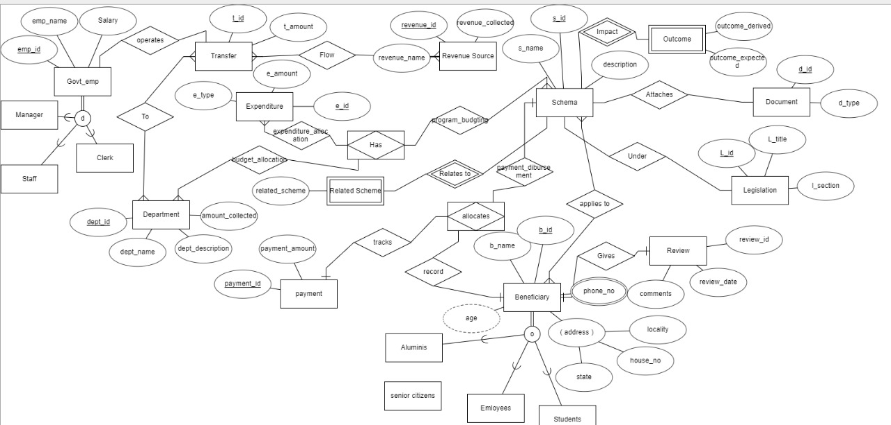

# Non-Tax Revenue Management System

## 📌 Project Overview
The **Non-Tax Revenue Management System** is a database management project designed to efficiently manage and monitor non-tax revenue sources for an organization/government.  
This system ensures proper storage, retrieval, and analysis of revenue-related data using a **relational database model**.

It demonstrates key **DBMS concepts** such as:
- Entity Relationship Diagram (ERD)
- Relational Schema
- Normalization
- SQL Queries for CRUD operations
- Backend & Templates for demonstration

---

## 📂 Project Structure
```

├── Back End/mydoc/         # Backend-related files/scripts
├── Templates/              # HTML templates (frontend)
├── ERD.jpg                 # Entity Relationship Diagram
├── Relational Schema.jpg   # Database schema design
├── Normalization-DBMS.xlsx # Normalization steps up to 3NF
├── README.md               # Project documentation

````

---

## 🗂 Database Design
### 1. ER Diagram  


### 2. Relational Schema  


### 3. Normalization
- Unnormalized Form (UNF) → 1NF → 2NF → 3NF
- Details included in **Normalization-DBMS.xlsx**

---

## ⚡ Features
- Manage multiple **revenue sources**  
- Store **payer details, payments, and receipts**  
- Ensure **data consistency** with normalization  
- Easy **query execution** for reports and analysis  
- Scalable for government/non-gov revenue applications  

---

## 🛠 Tech Stack
- **Database:** MySQL / PostgreSQL (can adapt to any RDBMS)  
- **Backend:** Python / Java / Node.js (your implementation choice)  
- **Frontend (Demo):** HTML Templates  
- **Tools Used:**  
  - MySQL Workbench (or pgAdmin)  
  - Excel (for normalization)  

---

## 🚀 How to Run
1. Clone this repository:
   ```bash
   git clone https://github.com/bhavyakosuri/Non-Tax-Revenue.git
   cd Non-Tax-Revenue-DBMS
````

2. Set up the database:

   * Create a new database in MySQL/PostgreSQL
   * Import tables based on **Relational Schema**

3. Load sample data (if provided).

4. Run backend scripts (inside `Back End/mydoc/`) if included.

5. Access demo frontend via `Templates/` (optional).
6. 
---

## 📖 Learning Outcomes

* Understanding of **ERD, schema design, normalization**
* Hands-on with **SQL queries & transactions**
* Importance of **database constraints** (PK, FK, etc.)
* Real-world application of DBMS concepts

---

## 📜 License

This project is for **academic and learning purposes** only.

```

